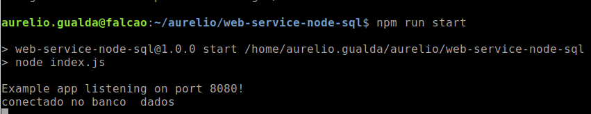
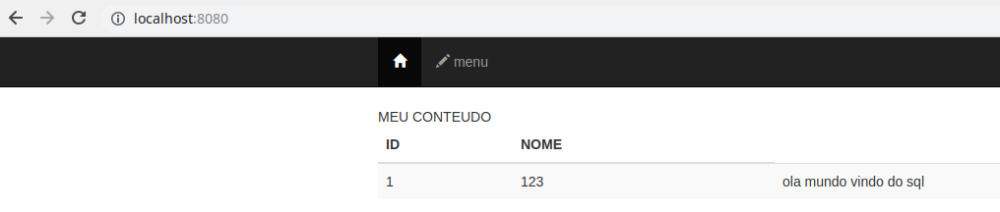

Escrevo esse cogido para fins de estudos.
 uma amostra de web express e conexão sql para iniciantes.

Contempla uma pagina inicial, conexão sql, exibição de dados  e um banco de dados para teste.

## preview 

## Pré-Requisitos:

 * node : https://nodejs.org/en/download/
 * mysql : https://www.mysql.com/downloads/
 

## build  and rund 
	npm install
	npm run build

#### comandos usados  

    npm init 
    npm install express --save-dev
    npm run start

    npm i nodemon --save-dev
    npm i mysql --save-dev
    npm i ejs --save-dev

### Referência:

* https://nodejs.org/docs/latest-v6.x/api/
* https://www.npmjs.com/package/mysql
* https://expressjs.com/pt-br/starter/hello-world.html

#### para instalar  um package com o node 

	npm  i nome-package-back --save-dev 
	
	npm  i nome-package-front --save

#### para executar scripts 

        npm run nome-do-script  // verificar no package.json  
 

